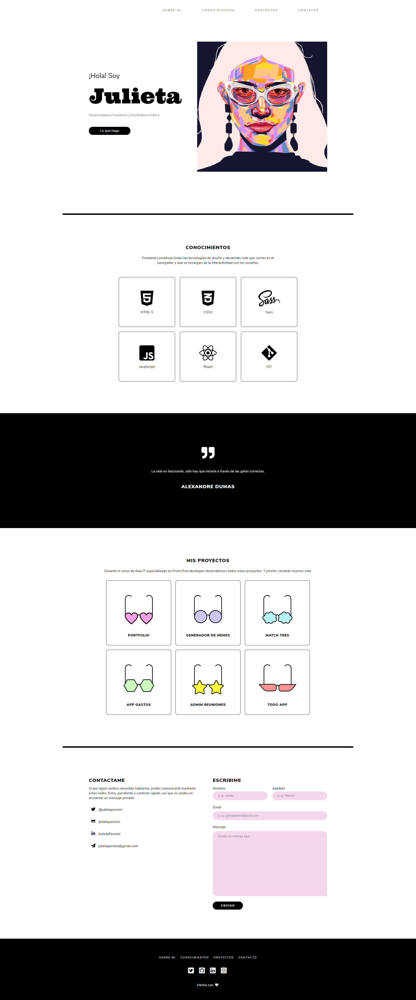

# Portfolio Personal - Proyecto ADA

## Para ver el proyecto completo hacé click acá 👇🏻
- [GitHub Pages](https://julietapennini.github.io/julietapennini/)
- [Netlify](https://epic-goldberg-17b45d.netlify.app)
***

# Índice
1. [Descripción](#descripción)
2. [Previsualización](#previsualización)
3. [Tecnologías](#tecnologías)
4. [Clonado](#clonado)
5. [Dependecias](#dependecias)
6. [Agradecimientos](#agradecimientos)

## Descripción

Este es el primer proyecto del Curso de Desarrollo Front-End de Ada y pertenece al Módulo 1: Introducción a HTML y CSS.

## Previsualización
Así deberías ver el proyecto ✨

## Tecnologías
- HTML5
- CSS3

## Clonado
Si querés hacer una copia de este repositorio seguí los siguientes pasos:

- En la página principal de este [repositorio](julietapennini.github.io/julietapennini/), clickeá el botón verde llamado **Code**.
- En la sección *Clone with HTTPS*, copiá la **URL** que está debajo.
- En tu dispositivo local, abrí la terminal de bash y cambiá tu directorio actual y activo por la ubicación en la que quieras clonar el repositorio. Usá el comando bash cd para ingresar a carpetas.
- Una vez que navegaste hasta el directorio donde querés poner el repositorio, ingresá git clone en tu terminal y pegá la **URL** que copiaste anteriormente justo al lado.
- Una vez que ejecutaste este comando, deberías tener una copia de este repositorio en tu computadora. Entrá a la carpeta del proyecto y abrirlo en tu IDE.

## Dependecias
Por ahora, este proyecto no requiere la instalación de ninguna dependencia.

## Agradecimientos
Gracias [Jonh](https://github.com/Jonhks) y [Leydy](https://github.com/leydyk93/).

Gracias amiga y compañera [Lula](https://github.com/lucilaguajardo).

***
Hecho con 🖤